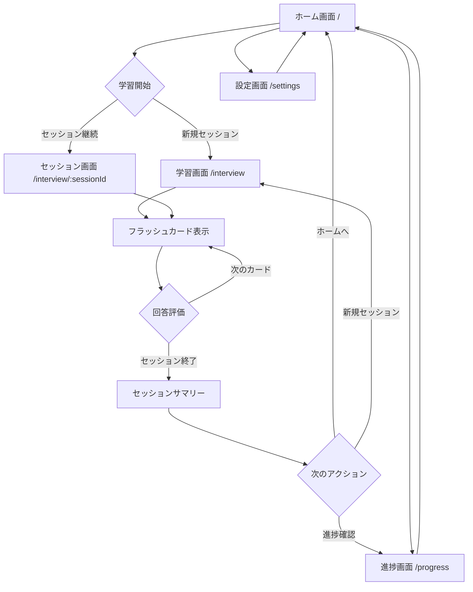

# データ仕様書

## データモデル詳細定義

### Interview (質問データ)
```typescript
interface Interview {
  id: string;                    // 一意識別子 (例: "llm_interview_001")
  question: string;              // 質問文
  answer: Answer;                // 詳細な回答情報
  category: Category;            // カテゴリー
  difficulty: Difficulty;        // 難易度
  tags: string[];                // タグリスト
  source: string;                // 出典情報
}

interface Answer {
  definition: string;            // 定義・概要
  importance: string;            // 重要性・理由
  mechanism: string;             // 仕組み・動作原理
  key_points: string[];          // 要点リスト（最低1つ必須）
  examples: string[];            // 具体例リスト
  applications: string;          // 応用例・使用場面
  advantages: string;            // 利点・メリット
  limitations: string;           // 制限・課題
  formulas: string[];            // 数式やアルゴリズム
  related_concepts: string;      // 関連概念
  additional_notes: string;      // 補足説明
}

type Category = 
  | "基礎概念"
  | "アーキテクチャ"
  | "学習手法"
  | "応用技術"
  | "評価指標"
  | "実装技術"
  | "倫理・社会的影響";

type Difficulty = "初級" | "中級" | "上級";
```

### UserProgress (ユーザー学習進捗)
```typescript
interface UserProgress {
  interviewId: string;           // 質問ID
  lastReviewedAt: Date;          // 最終学習日時
  reviewCount: number;           // 学習回数
  correctCount: number;          // 正解回数
  intervalDays: number;          // 次回学習までの間隔（日数）
  easeFactor: number;            // 難易度係数（SM-2アルゴリズム: 1.3〜2.5）
  nextReviewDate: Date;          // 次回学習予定日
  quality: number;               // 前回の回答品質（0-5）
}
```

### StudySession (学習セッション)
```typescript
interface StudySession {
  id: string;                    // セッションID (UUID)
  startedAt: Date;               // 開始時刻
  endedAt?: Date;                // 終了時刻
  reviewedInterviews: ReviewedInterview[]; // 学習した質問
  correctAnswers: number;        // 正解数
  totalAnswers: number;          // 回答総数
  averageResponseTime: number;   // 平均回答時間（秒）
}

interface ReviewedInterview {
  interviewId: string;           // 質問ID
  isCorrect: boolean;            // 正解/不正解
  reviewedAt: Date;              // 回答時刻
  responseTime: number;          // 回答時間（秒）
  quality: number;               // 回答品質（0-5）
  hintsShown: number;            // 表示したヒントの数（0=ヒント未使用）
}
```

### UserSettings (ユーザー設定)
```typescript
interface UserSettings {
  theme: "light" | "dark";       // テーマ設定
  cardsPerSession: number;       // 1セッションあたりのカード数（デフォルト: 20）
  enableSound: boolean;          // 効果音の有効/無効
  showTimer: boolean;            // タイマー表示の有効/無効
  autoFlip: boolean;             // 自動裏返し機能
  autoFlipDelay: number;         // 自動裏返しまでの遅延（秒）
  keyboardShortcuts: boolean;    // キーボードショートカットの有効/無効
}
```

### StudyStats (学習統計)
```typescript
interface StudyStats {
  totalCards: number;            // 総カード数
  studiedToday: number;          // 今日学習したカード数
  dueToday: number;              // 今日復習予定のカード数
  newToday: number;              // 今日の新規カード数
  streak: number;                // 連続学習日数
  averageAccuracy: number;       // 平均正解率（%）
  totalStudyTime: number;        // 総学習時間（分）
  categoryProgress: CategoryProgress[]; // カテゴリー別進捗
}

interface CategoryProgress {
  category: Category;            // カテゴリー
  totalCards: number;            // 総カード数
  masteredCards: number;         // 習得済みカード数（easeFactor > 2.0）
  averageAccuracy: number;       // 平均正解率（%）
}
```

## 画面遷移フロー・状態管理

### 画面遷移フロー



### 画面別の状態とアクション

#### 1. ホーム画面 (/)
**表示データ:**
- 今日の学習統計（StudyStats）
- 復習予定のカード数
- 連続学習日数
- 最近の学習セッション

**アクション:**
- 学習開始（新規/継続）
- 進捗画面へ遷移
- 設定画面へ遷移

#### 2. 学習画面 (/interview, /interview/:sessionId)
**表示データ:**
- 現在のカード（Interview）
- セッション進捗（current/total）
- タイマー（経過時間）
- 正解率

**状態管理:**
```typescript
interface StudyScreenState {
  // セッション情報
  session: StudySession;
  interviews: Interview[];
  
  // 現在のカード状態
  currentIndex: number;
  isFlipped: boolean;
  showHint: boolean;
  startTime: Date;
  
  // 学習記録
  responses: ReviewedInterview[];
  userProgress: Record<string, UserProgress>;
}
```

**アクション:**
- カードをフリップ
- 次/前のカードへ移動
- 回答品質を評価（0-5）
- ヒント表示/非表示
- セッション終了

#### 3. 進捗画面 (/progress)
**表示データ:**
- 総合統計（StudyStats）
- カテゴリー別進捗
- 学習履歴グラフ
- 習得済み/未習得カード一覧

**フィルター機能:**
- カテゴリー別
- 難易度別
- 期間別（週/月/全期間）

#### 4. 設定画面 (/settings)
**設定項目:**
- テーマ切り替え
- 学習設定（カード数、自動フリップ等）
- キーボードショートカット
- データ管理（エクスポート/インポート/リセット）

### グローバル状態管理

#### Context設計
```typescript
// 1. 設定Context
interface SettingsContextType {
  settings: UserSettings;
  updateSettings: (settings: Partial<UserSettings>) => void;
}

// 2. 学習進捗Context
interface ProgressContextType {
  progress: Record<string, UserProgress>;
  updateProgress: (interviewId: string, update: Partial<UserProgress>) => void;
  getNextReviewCards: (limit: number) => Interview[];
}

// 3. セッションContext
interface SessionContextType {
  activeSession: StudySession | null;
  startSession: (interviews: Interview[]) => string;
  endSession: (sessionId: string) => void;
  addResponse: (response: ReviewedInterview) => void;
}
```

### 状態管理パターン

#### ローカル状態（useState）
- カードのフリップ状態
- ヒント表示状態
- タイマー表示

#### セッション状態（Context or Remix loader/action）
- 現在のセッション情報
- 学習済みカードのリスト
- セッション統計

#### グローバル状態（localStorage + Context）
- ユーザー設定
- 学習進捗データ
- 統計情報

### コンポーネント間通信

```typescript
// カスタムフックでのデータ管理
const useStudySession = (sessionId: string) => {
  const [session, setSession] = useState<StudySession>();
  const [currentCard, setCurrentCard] = useState<Interview>();
  
  // セッションの読み込み
  // カードの切り替え
  // 評価の保存
  
  return { session, currentCard, actions };
};

// Remix loaderでのデータ取得
export const loader = async ({ params }: LoaderFunctionArgs) => {
  const interviews = await loadInterviews();
  const progress = loadProgressFromLocalStorage();
  
  return json({ interviews, progress });
};
```

## ローカルストレージ設計

### データ構造
```javascript
localStorage: {
  "llm-interview-progress": {
    [interviewId]: UserProgress
  },
  "llm-interview-sessions": StudySession[],
  "llm-interview-settings": {
    theme: "light" | "dark",
    cardsPerSession: number,
    enableSound: boolean
  }
}
```

### localStorage構造
```typescript
// キー設計
const STORAGE_KEYS = {
  SETTINGS: 'llm-interview-settings',
  PROGRESS: 'llm-interview-progress',
  SESSIONS: 'llm-interview-sessions',
  STATS: 'llm-interview-stats',
} as const;

// データ永続化フック
const useLocalStorage = <T>(key: string, defaultValue: T) => {
  const [value, setValue] = useState<T>(() => {
    const stored = localStorage.getItem(key);
    return stored ? JSON.parse(stored) : defaultValue;
  });

  const setStoredValue = (newValue: T) => {
    setValue(newValue);
    localStorage.setItem(key, JSON.stringify(newValue));
  };

  return [value, setStoredValue] as const;
};
```

### 状態更新フロー

#### 学習フロー
1. **セッション開始時**
   - 新規StudySessionを作成
   - SM-2アルゴリズムで学習カードを選択
   - activeSessionに設定

2. **カード評価時**
   - ReviewedInterviewを作成
   - UserProgressを更新（SM-2計算）
   - 次回復習日を計算
   - localStorageに保存

3. **セッション終了時**
   - セッション統計を計算
   - StudySessionを完了状態に更新
   - 全体統計を更新

#### データ同期
```typescript
// 定期的な自動保存
useEffect(() => {
  const interval = setInterval(() => {
    saveToLocalStorage();
  }, 5000); // 5秒ごと
  
  return () => clearInterval(interval);
}, []);

// ページ離脱時の保存
useEffect(() => {
  const handleBeforeUnload = () => {
    saveToLocalStorage();
  };
  
  window.addEventListener('beforeunload', handleBeforeUnload);
  return () => window.removeEventListener('beforeunload', handleBeforeUnload);
}, []);
```

### ナビゲーション制御

#### 学習中の離脱防止
```typescript
// Remix のナビゲーションブロッキング
const blocker = useBlocker(
  ({ currentLocation, nextLocation }) =>
    activeSession && !isSessionComplete &&
    currentLocation.pathname !== nextLocation.pathname
);

// 確認ダイアログ表示
if (blocker.state === "blocked") {
  return (
    <Modal>
      <p>学習セッションが進行中です。本当に離脱しますか？</p>
      <Button onClick={() => blocker.proceed()}>離脱</Button>
      <Button onClick={() => blocker.reset()}>続ける</Button>
    </Modal>
  );
}
```

## API設計

### ルート構成
- `/`: ホーム画面
- `/interview`: 面接画面
- `/interview/:sessionId`: 特定セッションの学習
- `/progress`: 進捗画面
- `/settings`: 設定画面

### データローダー
```typescript
// 問題データの読み込み
loader: async () => {
  const interviews = await fetch('/data.json');
  return json(await interviews.json());
}
```